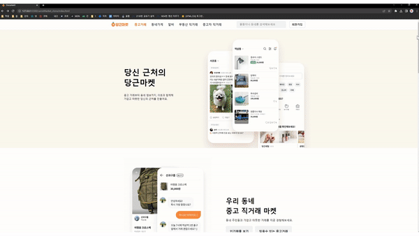

# 당근마켓 + 추가기능

## [링크](https://silver-cat-ed3c9d.netlify.app)

기존 당근마켓 메인 홈페이지의 디자인을 따라 만들어보고 회원가입 폼을 만들어 봤다.

## 하는 이유

- 그동안 코드를 따라 치는 식으로 공부를 너무 해서 머리에 잘 안남음
- 혼자서 기획부터 구현까지 작은 프로젝트 하나 제대로 해본 적이 없음
- 여러 토이프로젝트 중에 로그인 / 회원가입폼 작성이 중요하면서 쉬움
- css 역량이 많이 부족함
- 30 day javascript나 기타 자바스크립트 강의에서 배운 기능들을 써먹기 위해

## 소개

우선 당근마켓 메인 홈페이지는 개발자 도구(F12)를 적절히 보며 따라 만들었다.
(px단위로 정확하진 않음)
당근마켓은 기존의 회원가입이나 로그인이 따로 없어서(아마 모바일은 있을 것) 채팅하기 버튼 대신에 회원가입 버튼으로 바꿔서 클릭 시 회원가입 폼 페이지로 넘어가도록 하였다.

로그인폼은 구글에 로그인폼을 쳐서 이쁜 것 하나 골라서 따라 만들었다.

기능들을 여러 조건에 맞춰서 나열해 보았다.

유저의 데이터들은 로컬 스토리지를 사용해 저장하고 불러왔다.

## 기능

- ### 로그인

  - 로그인 성공 / 실패
    - 아이디가 틀린 경우
    - 패스워드만 틀린 경우
    - 조건에 맞게 아이디 / 패스워드를 입력한 경우

- ### 회원가입

  - 아이디 중복 확인
    - 아이디를 입력하지 않은 경우
    - 아이디가 이미 존재하는 경우
    - 아이디가 존재하지 않는 경우
  - 비밀번호
    - 공백이 들어간 경우
    - 영문자+숫자+특수문자 조합으로 8~25자리가 아닌 경우
    - 비밀번호를 조건에 맞게 입력한 경우
  - 이메일
    - 알파벳+숫자@알파벳+숫자.알파벳+숫자가 아닌 경우
    - 이메일을 조건에 맞게 입력한 경우
  - 전화번호
    - 전화번호 앞 번호를 선택하지 않은 경우
    - 전화번호 뒤 번호를 4자로 입력하지 않은 경우
    - 전화번호를 조건에 맞게 입력한 경우
  - 회원가입 완료
    - 회원가입완료 버튼을 중복확인을 안하고 누른 경우
    - 모든 조건을 만족한 상태에서 누른 경우

- ### 비밀번호 찾기

  - 아이디를 입력하지 않은 경우
  - 아이디가 틀린 경우
  - 아이디를 조건에 맞게 입력한 경우

위의 경우들에서 조건에 부합하지 않은 경우에는 경고 메시지를 1초동안 보여줬다.

## 느낀점

### 1. 변수명을 잘 짓기

처음에 변수명을 대충 짓고 나중에 수정하려니 번거롭고 시간도 많이 들었다.

이래서 코딩의 절반이 변수명 짓는 시간이다 라는 말이 괜히 나오는게 아니구나 싶었다.

처음에 좀 공들여서 변수명을 합리적으로 지어보자.

### 2. 일단 돌아가게 하기

자바스크립트는 반대로 일단 돌아가게 하는게 우선인 것 같다.

그렇다고 처음부터 너무 막 짜는건 별로지만, 우선 다 만드는데 초점을 두고, 나중에 리팩토링할때 겹치는 부분을 함수로 따로 뺀다거나 하는 식의 조정이 필요하다 생각한다.

처음부터 이런 것 까지 따져가면서 하기에는 시간이 너무 많이 걸리고 비효율적이라 생각이 든다.

### 3. 욕심 부리지 말기

초기에 생각했던 기능들은 되게 간단하였는데 하다보니 계속 욕심이 나서 기능들을 하나하나 추가하려다 보니 기본 기능에 충실하지 못해서 오히려 산으로 가는 느낌이 들었다.

추가 기능은 반드시 기본 기능을 완벽히 구현한 후에 만들어 보자.

### 4. `innertext` 또는 `innnerHTML`의 변화는 css 스타일을 주지 못하나?

처음에는 에러 메시지를 `class`를 toggle하는 방식으로 하려다 이것보다 `innertext`로 구현하는 것이 더 깔끔해서 중간에 수정을 하였는데 이렇게 하니까 `transition` 기능이 먹히지 않는다.

구글링 결과 재귀함수나 for문을 사용해서 `setInterval`을 이용하는 방법이 있는데 어색해서 안하느니만 못하고, `opacity`를 사용하는 방법이 자연스럽다.

제이쿼리에는 `fade in/out`함수가 따로 있지만 바닐라 자바스크립트에는 없어서 따로 만들어야한다.

그런데 보통 텍스트에는 이런 내용을 사용하지 않으니 앞으로는 클래스를 사용하는 것이 나을 듯 하다.

### 5. `form` 태그 안에는 `form`가 들어가지 못한다.

### 6. 커밋을 좀 더 쪼개서 하자.

전체기능을 완성했을 때 커밋을 하는 것이 아니라 기능이 추가될 때마다 그때그때 커밋을 하는 습관을 들여놓자.

### 7. 코드 리뷰를 받아보자.

실력은 코드리뷰와 꾸준한 유지보수에서 오른다.

분명히 혼자 처음하는 토이프로젝트 이다보니 코드가 엉망진창일 것이다.

피드백을 받으며 개선하다보면 내용의 필요성을 깨닫고 이것은 실무 경험으로 자연스럽게 이어진다.

### 8. 반응형을 좀 더 공부해보자.

아직 반응형에 덜 익숙해서 최소한의 기능만 만들어봤는데 여러가지 반응형 기능을 시도해봐야겠다.
